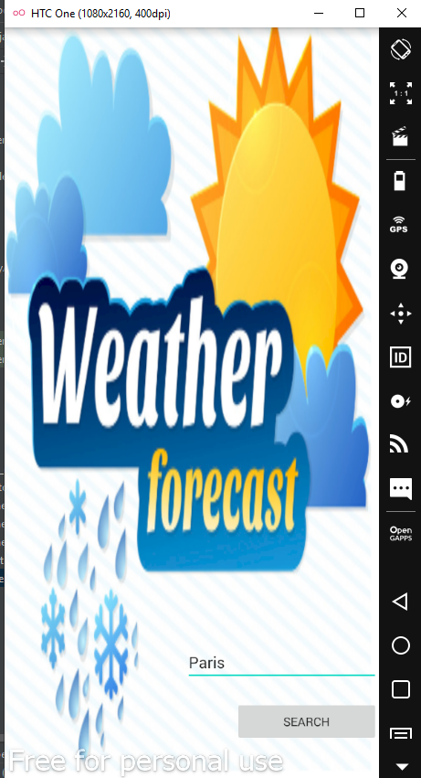
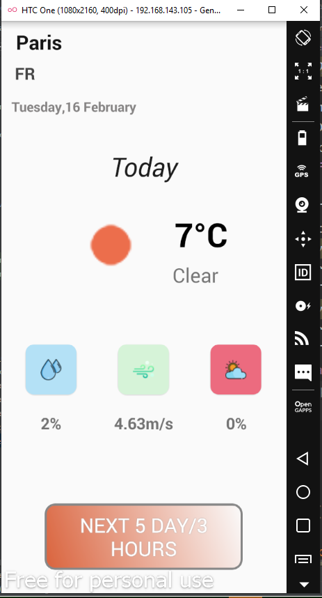
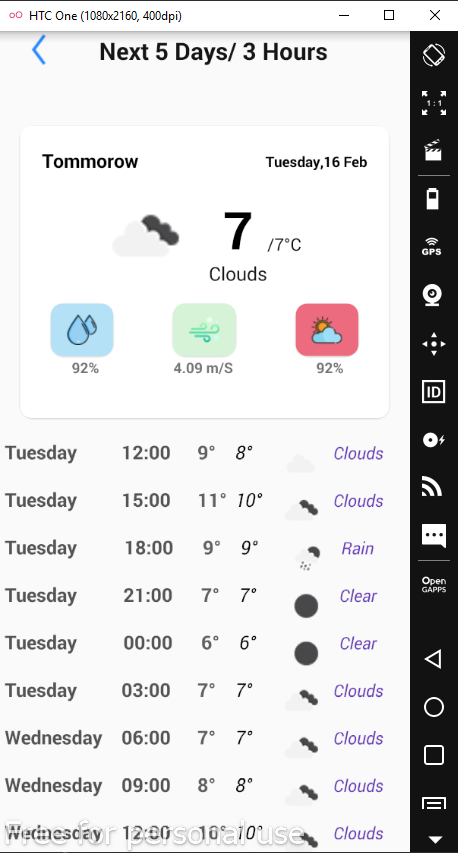

# WeatherLocation
project Simple
# Usage

# Built With
 - Butter Knife - Field and method binding for Android views
 - Retrofit - A type-safe HTTP client for Android and Java
 - OpenWeatherMap - Weather API used
 - Gson - A Java serialization/deserialization library to convert Java Objects into JSON and back
 - Picasso - A powerful image downloading and caching library for Android
 
# Acknowledgments
  - Inspiration Simple Weather App
  - MaterialDesignDemo by stormyhide
